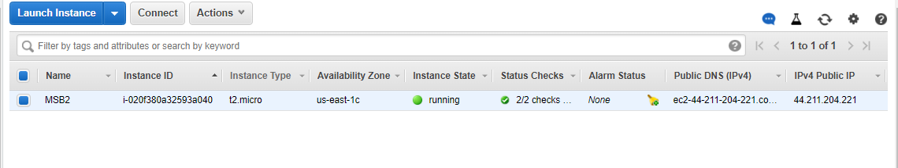

## Presentation and Documentation of Project 1

**Connecting to EC2 terminal**

**Connection to the first linux server (Ubuntu Server)**

**Install Apache using Ubuntu’s package manager ‘apt’:**

**sudo apt update**

**sudo apt install apache2**

**Verifing that apache2 is running as a Service in our OS**

**sudo systemctl status apache2**

**Apache2 Ubuntu Default Page**

**installing my MYSQL**

**sudo apt install mysql-server**

**sudo mysql**

**sudo apt install php libapache2-mod-php php-mysql**

**php -v**

**creating visual host for website**

**http://<Public-IP-Address>:80**

**ENABLE PHP ON THE WEBSITE**

[phpwebsite](http://44.202.58.181/)

